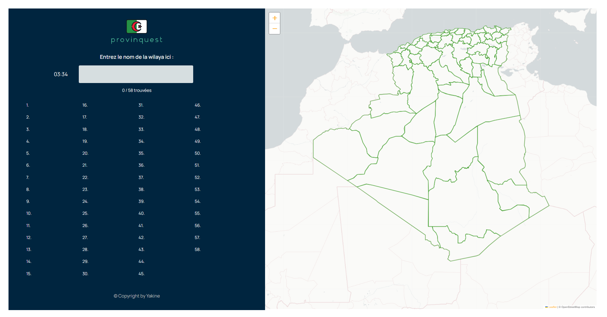

# Algerian Provinces Quiz Game using Leaflet

## Introduction

Welcome to the Algerian Provinces Quiz Game! This interactive game is designed to test your knowledge of the provinces in Algeria using the Leaflet library.

## Getting Started

1. Clone this repository to your local machine.
2. Open `index.html` in a web browser that supports JavaScript.
3. You're ready to start playing the quiz game!

## How to Play

1. Press start to start the game.
2. Start typing provinces names.
3. Whenever a province is found, it appears on the map, and its name is displayed in the list.
4. Keep answering questions until the quiz is complete.
5. Your final score will be displayed at the end of the quiz.

## Technologies Used

- [Leaflet](https://leafletjs.com/): An open-source JavaScript library for interactive maps.
- HTML, CSS, and JavaScript for building the game interface and functionality.

## License

This project is licensed under the [MIT License](LICENSE).

## Acknowledgements

- Algerian provinces data sourced from [Wilayas-Algeria](https://github.com/iladan0/Wilayas-Algeria) and [Wikipedia](https://en.wikipedia.org/wiki/Provinces_of_Algeria).

## Contact

If you have any questions or suggestions, feel free to reach out to me.
